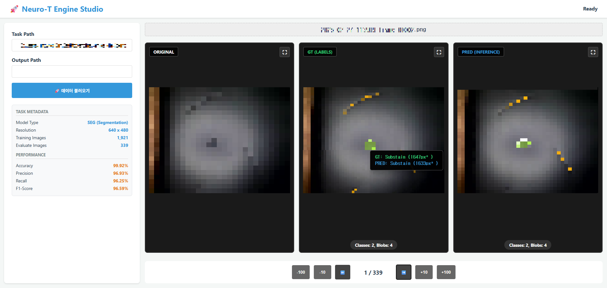
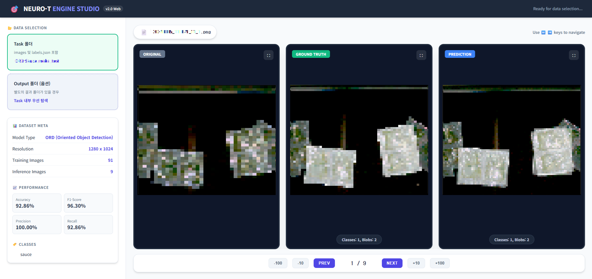

# 🚀 Engine Studio (멀티뷰 분석 대시보드)

> **딥러닝 모델의 추론 결과를 시각적으로 정밀하게 비교 분석할 수 있는 웹 기반 대시보드입니다.**

---

## 🔗 실시간 서비스 접속
👉 **[https://engine-studio.pages.dev/](https://engine-studio.pages.dev/)**
*(설치 없이 브라우저에서 바로 사용 가능)*

---

## 📺 프로젝트 시연

### 1. SEG (Segmentation) 분석

*세그멘테이션 모델의 GT와 Pred 마스크 비교 및 실시간 면적 분석*

### 2. ORD (Oriented Object Detection) 분석

*회전 박스 모델의 정확한 위치 매핑 및 각도 디버깅*

---

## 🛡️ 프로젝트 개요 및 목적
*   **시각적 분석 도구:** 강력한 딥러닝 엔진의 추론 결과를 이미지 위에서 직관적으로 확인하고 검증할 수 있는 도구입니다.
*   **Image-to-Image 정밀 분석:** 단순 수치(Metrics) 확인을 넘어, 실제 이미지 위에서 레이블(GT)과 추론 결과(PRED)가 어떻게 어긋나는지 육안으로 검증할 수 있는 환경을 제공합니다.
*   **보안 중심 브라우저 네이티브:** 모든 데이터는 서버 업로드 없이 사용자의 브라우저 내에서만 처리되어 보안이 완벽하게 유지됩니다.

---

## ✨ 주요 기능

### 1. 🔍 3-View 동기화 분석 시스템
*   **Original / GT / PRED** 세 가지 뷰를 동일한 타임라인으로 동기화하여 표시함.
*   이미지 전환 시 모든 뷰가 즉시 갱신되어 모델의 오검출 및 미검출 사례를 빠르게 파악 가능.

### 2. 📏 실시간 면적 및 Cross-Highlighting
*   **Shoelace Algorithm:** 마스크(Blob)에 마우스를 올리면 실시간으로 정밀 면적(px²)을 계산하여 제공.
*   **Cross-Panel Sync:** GT 뷰의 특정 영역 호버 시 PRED 뷰의 동일 위치 영역이 자동으로 강조(볼더링)되어 일치 여부를 즉시 확인 가능.
*   **Event Trigger:** 단축키를 이용한 내비게이션 시에도 마우스 위치의 정보가 즉시 현행화됨.

### 3. 📐 다양한 모델 타입 완벽 지원
*   **SEG (Segmentation):** 폴리곤 기반 정밀 마스크 렌더링.
*   **ORD (Oriented Object Detection):** 중앙 좌표, 크기, 각도 기반의 회전 박스(`obox`) 지원.
*   **ROT (Rotation):** 이미지별 회전 각도 분석 및 시각화 지원.

### 4. ⚡ 고성능 브라우저 처리
*   **Web Worker:** 대량의 추론 데이터를 비동기 워커에서 처리하여 UI 멈춤 현상 방지.
*   **PixiJS Rendering:** WebGL 가속을 사용하는 PixiJS 라이브러리를 통해 수천 개의 폴리곤도 부드럽게 렌더링.
*   **Smart Zoom:** 확대 다이얼로그 내에서 중앙 정렬 기반의 휠 줌 및 드래그(Pan) 지원.

---

## 🛠 기술 스택
*   **Frontend:** HTML5, Vanilla JS, CSS3
*   **Rendering:** PixiJS (WebGL), HTML5 Canvas
*   **Data Processing:** Web Workers (Client-side indexing)
*   **Deployment:** Cloudflare Pages

---

## 🚀 사용 방법
1.  **[실시간 접속 링크](https://engine-studio.pages.dev/)**를 클릭합니다.
2.  왼쪽 사이드바의 **Task 폴더 선택**에서 분석할 로컬 폴더를 지정합니다. (이미지와 `labels.json` 포함)
3.  필요 시 **Output 폴더**를 별도로 선택하여 결과 데이터를 로드합니다.
4.  키보드와 마우스를 사용하여 정밀 분석을 수행합니다.

---

## ⌨️ 단축키 안내
| 기능 | 단축키 |
| :--- | :--- |
| **다음 / 이전 이미지** | `→` / `←` |
| **10개 / 100개 점프** | `Shift` / `Alt` + `화살표` |
| **탭 전환 (확대창)** | `1`(Orig), `2`(GT), `3`(Pred) |
| **확대 / 축소 / 리셋** | `+` / `-` / `0` |
| **확대창 닫기** | `ESC` |

---

## 📄 라이선스
Copyright © 2026 jw3520. All rights reserved.
